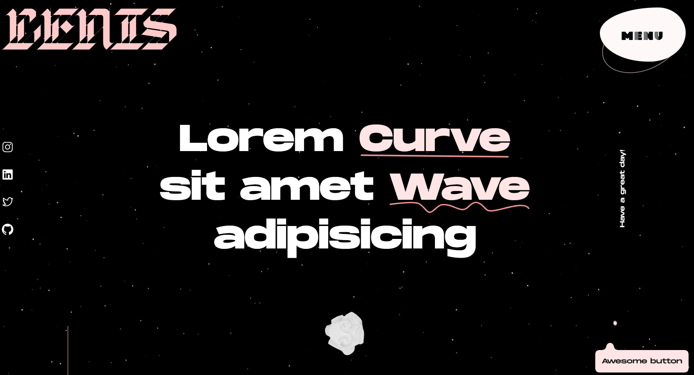

# Story React

This Layout made with React, Radix UI(with Icons, Colors), Stitches, PropType, React Three, Gsap with Lenis, Tailwind and Postcss.

## [Demo Link](https://story-react.netlify.app)



## Tech Stack

**Client:** React, Radix UI, Stitches, React Three Fiber with Drei, Gsap with Lenis, Classnames, PropType, React Particles, SVGR, TailwindCSS, Postcss like Sass, Radix Icons and Colors.

## Features

- Pnpm, Vite
- Eslint, Prettier, Stylelint Husky and Lint-staged
- Git flow
- Netlify

## Run Locally

Clone the project

```bash
  git clone https://github.com/AliBagheri2079/story-react.git


```

Go to the project directory

```bash
  cd story-react


```

Install dependencies

```bash
  pnpm install


```

Start the server

```bash
  pnpm run dev


```

Format the Component

```bash
  pnpm run format


```

linting the Component

```bash
  pnpm run lint


```

## Deployment

To deploy this project run

```bash
  pnpm run deploy


```

## 🚀 About Me

I'm Ali Bagheri. Learning about 3 years on Frontend Development Position ...

## 🔗 Links

[](https://github.com/AliBagheri2079)

[](https://www.linkedin.com/in/alibagheri2079/)

[](https://twitter.com/AliBagheri2079)
